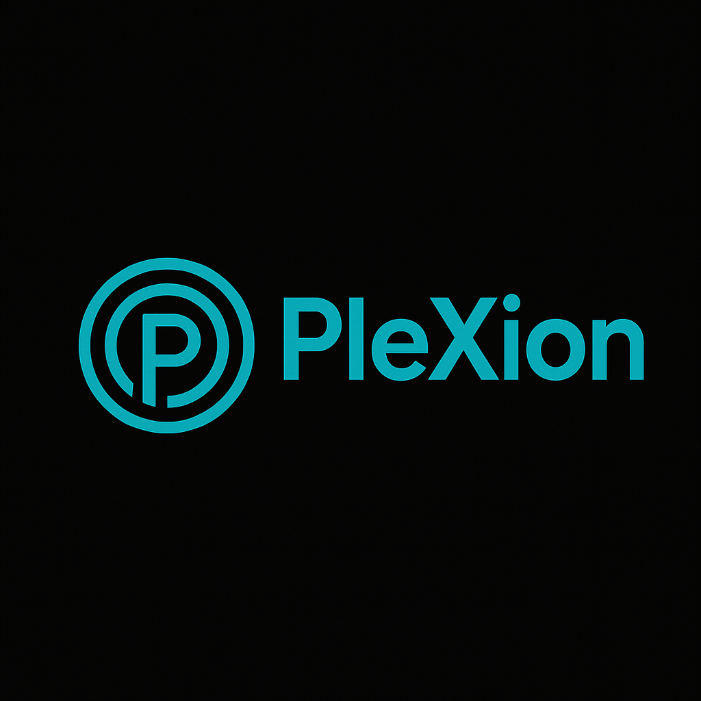

# ⚡ PleXion Framework

PleXion is a lightweight, annotation-driven Java framework built to rival Spring — starting with RESTful microservice foundations and evolving into a full-stack powerhouse with MVC, reactive support, and server-side React rendering.



---

## ✨ Features

- 🔌 Modular plugin bootloader with isolated class loading
- ⚙️ Annotation-based dependency injection
- 🌐 REST controllers with `@Get`, `@Post`, `@PathVariable`, `@RequestBody`
- 📦 Plugin lifecycle management (`@OnLoad`, `@OnDestroy`)
- 🔄 JSON support via Gson
- 🧱 MVC support with Pebble (Phase 2)
- 🧠 Hibernate-based ORM layer (Phase 2)
- ⚛️ Reactive engine via Netty (Phase 3)
- 📘 Auto-generated documentation system (Phase 3)
- ⚛️🎨 Server-side React rendering (Phase 4)
- 🔐 Built-in security and scheduling modules (Phase 5+)
- 🧰 Dev CLI, dashboard, and plugin marketplace (Phase 6+)

---

## 📦 Roadmap Overview

| Phase | Description |
|-------|-------------|
| **Phase 1** | REST Server + Open Source Release |
| **Phase 2** | MVC + Hibernate Database Integration |
| **Phase 3** | Reactive Netty Engine + Doc Generator |
| **Phase 4** | Server-side React Rendering |
| **Phase 5** | Security and Scheduling |
| **Phase 6** | Auto-Configuration + Dev Tools |
| **Phase 7** | Plugin Marketplace and Ecosystem |

See [ROADMAP.md](./ROADMAP.md) for full milestone tracking.

---

## 🚀 Getting Started

### ✅ Requirements
- Java 17+
- Maven 3.8+

### 📥 Install

```bash
git clone https://github.com/your-org/plexion.git
cd plexion/PluginLoader
mvn clean install
```

### ▶️ Run Sample App

```bash
cd plexion-base
java -jar target/plexion-base.jar
```

---

## 🧠 Annotation Reference

| Annotation | Description |
|------------|-------------|
| `@RestController` | Marks a REST class |
| `@Get`, `@Post`, etc. | Maps HTTP methods to Java methods |
| `@PathVariable` | Injects route parameters |
| `@RequestBody` | Binds JSON to object |
| `@Inject` | Injects a bean into a field |
| `@OnLoad`, `@OnDestroy` | Lifecycle hooks for plugins/beans |
| `@Config` (Phase 2) | Injects config value from file |
| `@Doc` (Phase 3) | Adds documentation metadata |
| `@Secured` (Phase 5) | Secures endpoint by role |

---

## 🤝 Contributing

We welcome contributors of all skill levels! Read our [CONTRIBUTING.md](./CONTRIBUTING.md) to get started.

---

## 🧪 Example Plugins

- `helloPlugin.jar` – basic startup plugin
- `goodbyePlugin.jar` – lifecycle demonstration
- Coming soon: REST plugins, MVC, and SSR React samples

---

## ⚖️ License

PleXion is released under the MIT License. Build boldly.

---

## 🌟 Join the Mission

We're building a developer-first framework that doesn't hide behind magic. Join us on our mission to create the most transparent, hackable Spring alternative ever made.
